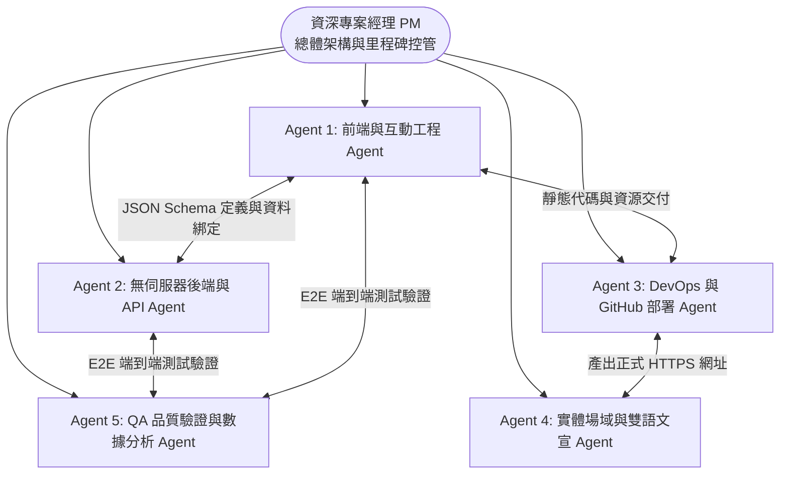
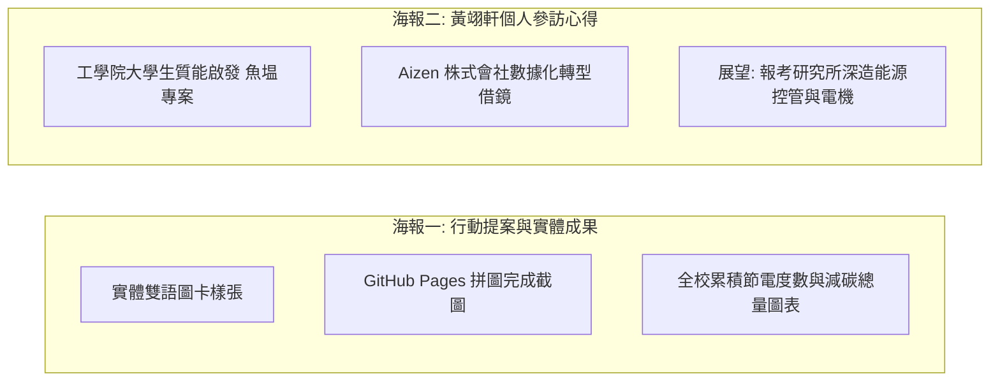

# NEXT ZERO 校園永續拼圖系統：GitHub Pages 多 Agent 協同開發與專案執行技術規格書

---

## 壹、 專案架構方針確認

> **【專案經理確認聲明】**  
> 本專案已**全面確立並鎖定採用 GitHub Pages 作為唯一正式的前端託管與執行方案**。  
> 透過 GitHub Pages 搭配 Google 生態系（Forms + Sheets + Google Apps Script API），打造 100% 零伺服器成本（Serverless）、高擴展性、支援客製化 CSS Grid 拼圖動畫及即時 RESTful API 數據綁定的現代化 Jamstack 架構。

---

## 貳、 專案管理架構與多 Agent 分工矩陣 (PM Perspective)

作為資深軟體專案經理（Lead Technical Project Manager），為確保專案自「程式開發、雲端 API 串接、CI/CD 部署」至「實體校園場域落地與海報發表」能高度並行且精準交付，本專案劃分為 **5 大專業 AI Agent** 進行協同作業。



---

### 一、 多 Agent 責任分配矩陣 (RACI Matrix)

* **R (Responsible)**：負責執行開發  
* **A (Accountable)**：最終成果當責  
* **C (Consulted)**：諮詢與規格協調  
* **I (Informed)**：知會與進度同步  

| 工作項目 / 交付物 | Agent 1 (前端) | Agent 2 (後端) | Agent 3 (DevOps) | Agent 4 (文宣場域) | Agent 5 (QA數據) |
| :--- | :---: | :---: | :---: | :---: | :---: |
| **HTML5/CSS3/JS 前端與拼圖狀態機** | **R / A** | C | C | I | C |
| **Google Forms/Sheets/GAS API 串接** | C | **R / A** | I | I | C |
| **GitHub Repository 與 Pages 部署** | C | I | **R / A** | I | I |
| **防水雙語圖卡與 QR Code 場域整合** | I | I | C | **R / A** | I |
| **E2E 流程測試與減碳效益換算驗證** | C | C | I | I | **R / A** |
| **雙海報成果展示資料整合** | C | C | I | C | **R / A** |

---

## 參、 各 Agent 詳細職責、技術規範與產出清單

---

### 🤖 Agent 1：前端與互動工程 Agent (Lead Frontend & UI/UX Agent)

#### 1. 核心任務
- 負責以語意化 HTML5、現代化 Vanilla CSS 與純原生 JavaScript 構建輕量化前端。
- 實現 $4 \times 4$（16 塊）或 $N \times N$ 之 **CSS Grid 動態遮罩拼圖**，支援平滑漸變解鎖動畫。
- 建立非同步 API 拉取、數字滾動遞增動畫（Count-up Animation）與離線降級容錯機制。

#### 2. 技術規格與核心代碼

##### (1) `index.html`（語意化前端骨架）
```html
<!DOCTYPE html>
<html lang="zh-TW">
<head>
  <meta charset="UTF-8">
  <meta name="viewport" content="width=device-width, initial-scale=1.0">
  <title>NEXT ZERO 校園永續拼圖解鎖計畫</title>
  <link rel="stylesheet" href="style.css">
  <link rel="preconnect" href="https://fonts.googleapis.com">
  <link rel="preconnect" href="https://fonts.gstatic.com" crossorigin>
  <link href="https://fonts.googleapis.com/css2?family=Noto+Sans+TC:wght@400;500;700&display=swap" rel="stylesheet">
</head>
<body>
  <header class="header">
    <div class="header-badge">NEXT ZERO 行動提案</div>
    <h1>校園永續社區拼圖</h1>
    <p class="subtitle">完成日常減碳任務，合力解鎖全校綠色未來畫卷</p>
  </header>

  <main class="container">
    <section class="action-section">
      <a href="YOUR_GOOGLE_FORM_URL" target="_blank" rel="noopener noreferrer" class="btn-primary" id="btn-upload">
        <span class="icon">📸</span> 點我上傳節能任務佐證
      </a>
      <p class="hint">免註冊帳號，拍照上傳即可累積全校減碳成果！</p>
    </section>

    <section class="puzzle-wrapper">
      <div class="puzzle-header">
        <h2>全校解鎖進度</h2>
        <span class="badge-progress" id="progress-text">載入中...</span>
      </div>
      <div id="puzzle-container">
        <div id="grid"></div>
      </div>
    </section>

    <section class="stats-grid">
      <div class="stat-card">
        <span class="stat-icon">🧩</span>
        <div class="stat-info">
          <h3 id="approved-count">0</h3>
          <p>已解鎖板塊</p>
        </div>
      </div>
      <div class="stat-card">
        <span class="stat-icon">⚡</span>
        <div class="stat-info">
          <h3 id="saved-kwh">0</h3>
          <p>預估省電 (度)</p>
        </div>
      </div>
      <div class="stat-card">
        <span class="stat-icon">🌱</span>
        <div class="stat-info">
          <h3 id="saved-carbon">0</h3>
          <p>預估減碳 (kg CO₂e)</p>
        </div>
      </div>
    </section>

    <section class="tasks-guide">
      <h2>📋 三大減碳解鎖任務</h2>
      <div class="task-list">
        <div class="task-item">
          <span class="task-tag tag-a">任務 A</span>
          <div class="task-desc"><strong>隨手節能：</strong>無人教室關冷氣/燈，或空調設定 26–28°C。</div>
        </div>
        <div class="task-item">
          <span class="task-tag tag-b">任務 B</span>
          <div class="task-desc"><strong>低碳生活：</strong>自備環保餐具/環保杯，或少搭 3 層內電梯。</div>
        </div>
        <div class="task-item">
          <span class="task-tag tag-c">任務 C</span>
          <div class="task-desc"><strong>校園巡檢：</strong>巡查並拍照回報校園公用設備異常耗能或漏水。</div>
        </div>
      </div>
    </section>
  </main>

  <footer class="footer">
    <p>NEXT ZERO Campus Sustainability Initiative © 2026</p>
  </footer>

  <script src="app.js"></script>
</body>
</html>
```

##### (2) `style.css`（現代化 UI 與 CSS Grid 拼圖）
```css
:root {
  --primary-color: #2e7d32;
  --primary-hover: #1b5e20;
  --bg-color: #f6f8f7;
  --card-bg: #ffffff;
  --text-main: #212529;
  --text-muted: #6c757d;
  --mask-color: rgba(20, 30, 24, 0.94);
  --border-radius: 14px;
}

* { box-sizing: border-box; margin: 0; padding: 0; }
body {
  font-family: 'Noto Sans TC', sans-serif;
  background-color: var(--bg-color);
  color: var(--text-main);
  line-height: 1.6;
  padding: 24px 16px;
}

.header { text-align: center; max-width: 640px; margin: 0 auto 24px; }
.header-badge {
  display: inline-block; background-color: #e8f5e9; color: var(--primary-color);
  font-size: 13px; font-weight: 700; padding: 4px 12px; border-radius: 20px; margin-bottom: 8px;
}
.header h1 { font-size: 26px; color: #1a3024; margin-bottom: 6px; }
.subtitle { color: var(--text-muted); font-size: 14px; }

.container { max-width: 640px; margin: 0 auto; display: flex; flex-direction: column; gap: 20px; }

.action-section {
  text-align: center; background: var(--card-bg); padding: 20px;
  border-radius: var(--border-radius); box-shadow: 0 4px 16px rgba(0,0,0,0.05);
}

.btn-primary {
  display: inline-flex; align-items: center; justify-content: center; gap: 8px;
  background-color: var(--primary-color); color: #fff; text-decoration: none;
  font-size: 16px; font-weight: 700; padding: 14px 28px; border-radius: 30px;
  transition: all 0.25s ease; box-shadow: 0 4px 12px rgba(46,125,50,0.25);
  width: 100%; max-width: 320px;
}
.btn-primary:hover {
  background-color: var(--primary-hover); transform: translateY(-2px);
  box-shadow: 0 6px 16px rgba(46,125,50,0.35);
}
.hint { font-size: 12px; color: var(--text-muted); margin-top: 10px; }

/* 4x4 拼圖容器 */
.puzzle-wrapper {
  background: var(--card-bg); padding: 20px; border-radius: var(--border-radius);
  box-shadow: 0 4px 16px rgba(0,0,0,0.05);
}
.puzzle-header { display: flex; justify-content: space-between; align-items: center; margin-bottom: 14px; }
.puzzle-header h2 { font-size: 18px; color: #1a3024; }
.badge-progress {
  background-color: #e8f5e9; color: var(--primary-color);
  font-size: 12px; font-weight: 700; padding: 4px 10px; border-radius: 12px;
}

#puzzle-container {
  position: relative; width: 100%; padding-top: 75%; /* 4:3 比例 */
  background: url('puzzle.jpg') no-repeat center center;
  background-size: cover; border-radius: 10px; overflow: hidden;
}
#grid {
  position: absolute; top: 0; left: 0; width: 100%; height: 100%;
  display: grid; grid-template-columns: repeat(4, 1fr); grid-template-rows: repeat(4, 1fr);
}
.tile {
  background-color: var(--mask-color);
  border: 0.5px solid rgba(255, 255, 255, 0.18);
  transition: background-color 0.8s cubic-bezier(0.4, 0, 0.2, 1);
}
.tile.unlocked { background-color: transparent !important; }

/* 統計卡片 */
.stats-grid { display: grid; grid-template-columns: repeat(3, 1fr); gap: 12px; }
.stat-card {
  background: var(--card-bg); padding: 16px 12px; border-radius: var(--border-radius);
  text-align: center; box-shadow: 0 4px 16px rgba(0,0,0,0.05);
}
.stat-icon { font-size: 22px; }
.stat-info h3 { font-size: 20px; color: var(--primary-color); font-weight: 700; }
.stat-info p { font-size: 11px; color: var(--text-muted); font-weight: 500; }

/* 任務清單 */
.tasks-guide {
  background: var(--card-bg); padding: 20px; border-radius: var(--border-radius);
  box-shadow: 0 4px 16px rgba(0,0,0,0.05);
}
.tasks-guide h2 { font-size: 16px; margin-bottom: 14px; }
.task-list { display: flex; flex-direction: column; gap: 12px; }
.task-item { display: flex; align-items: flex-start; gap: 10px; font-size: 13px; }
.task-tag { font-size: 11px; font-weight: 700; padding: 2px 8px; border-radius: 6px; white-space: nowrap; }
.tag-a { background: #e3f2fd; color: #1976d2; }
.tag-b { background: #e8f5e9; color: #388e3c; }
.tag-c { background: #fff3e0; color: #f57c00; }

.footer { text-align: center; font-size: 12px; color: var(--text-muted); margin-top: 24px; }

@media (max-width: 480px) {
  .stats-grid { grid-template-columns: 1fr; }
  .stat-card { display: flex; align-items: center; text-align: left; padding: 12px 18px; gap: 16px; }
}
```

##### (3) `app.js`（非同步 API 串接與狀態機）
```javascript
const API_URL = "YOUR_GAS_WEB_APP_URL";
const TOTAL_TILES = 16;

document.addEventListener('DOMContentLoaded', () => {
  initGrid();
  fetchProgress();
});

function initGrid() {
  const grid = document.getElementById('grid');
  grid.innerHTML = '';
  for (let i = 0; i < TOTAL_TILES; i++) {
    const tile = document.createElement('div');
    tile.className = 'tile';
    tile.id = `tile-${i}`;
    grid.appendChild(tile);
  }
}

async function fetchProgress() {
  const progressText = document.getElementById('progress-text');
  try {
    const res = await fetch(API_URL);
    if (!res.ok) throw new Error(`HTTP ${res.status}`);
    const data = await res.json();

    animateValue('approved-count', 0, data.totalApproved, 800);
    animateValue('saved-kwh', 0, parseFloat(data.savedKWh), 800);
    animateValue('saved-carbon', 0, parseFloat(data.savedCarbonKG), 800);

    const unlockCount = Math.min(data.totalApproved, TOTAL_TILES);
    progressText.innerText = `已解鎖 ${unlockCount} / ${TOTAL_TILES} 塊 (${Math.round((unlockCount / TOTAL_TILES) * 100)}%)`;

    for (let i = 0; i < unlockCount; i++) {
      const tile = document.getElementById(`tile-${i}`);
      if (tile) {
        setTimeout(() => tile.classList.add('unlocked'), i * 60);
      }
    }
  } catch (err) {
    console.error('API 讀取異常:', err);
    progressText.innerText = '示範模式 (離線)';
    for (let i = 0; i < 3; i++) {
      const tile = document.getElementById(`tile-${i}`);
      if (tile) tile.classList.add('unlocked');
    }
  }
}

function animateValue(id, start, end, duration) {
  const obj = document.getElementById(id);
  if (!obj) return;
  const isFloat = end % 1 !== 0;
  let startTimestamp = null;
  const step = (timestamp) => {
    if (!startTimestamp) startTimestamp = timestamp;
    const progress = Math.min((timestamp - startTimestamp) / duration, 1);
    const val = progress * (end - start) + start;
    obj.innerText = isFloat ? val.toFixed(1) : Math.floor(val);
    if (progress < 1) {
      window.requestAnimationFrame(step);
    } else {
      obj.innerText = isFloat ? end.toFixed(1) : end;
    }
  };
  window.requestAnimationFrame(step);
}
```

---

### 🤖 Agent 2：無伺服器後端與 API Agent (Serverless Backend & Cloud Integration Agent)

#### 1. 核心任務
- 負責建立 Google 表單與 Google 試算表之資料結構與資料驗證規格。
- 開發 Google Apps Script (GAS) 之 `doGet()` API 端點，處理跨網域 JSON 輸出與能源換算。
- 實作審核狀態管線（待審核 ➔ 通過 / 退回）。

#### 2. 技術規格與核心代碼

##### (1) Google 試算表欄位結構定義

| 欄位編號 | 欄位名稱 | 資料來源 | 說明與驗證規則 |
| :---: | :--- | :--- | :--- |
| **A** | 時間戳記 | Google Form 自動產生 | 格式：`YYYY/MM/DD HH:mm:ss` |
| **B** | 暱稱 / 系級 | 師生輸入 | 字串（如：電機三甲 王小明） |
| **C** | 執行的節能任務 | 師生單選 | 選項：`任務A. 隨手關閉冷氣/電燈`、`任務B. 自備餐具或走樓梯`、`任務C. 巡檢異常耗能` |
| **D** | 任務佐證照片 | 師生上傳 | Google Drive 圖片連結 |
| **E** | **審核狀態** | **管理員手動維護** | **資料驗證下拉選單**：`待審核`（預設）、`通過`、`退回` |

##### (2) `Code.gs`（GAS RESTful Web App 程式碼）
```javascript
function doGet(e) {
  try {
    var sheet = SpreadsheetApp.getActiveSpreadsheet().getActiveSheet();
    var data = sheet.getDataRange().getValues();
    
    var totalApproved = 0;
    var taskCounts = { "taskA": 0, "taskB": 0, "taskC": 0 };
    
    // 略過第 1 列標題列，遍歷所有資料列
    for (var i = 1; i < data.length; i++) {
      var row = data[i];
      var taskText = String(row[2] || "");
      var auditStatus = String(row[4] || "");
      
      if (auditStatus.trim() === "通過") {
        totalApproved++;
        if (taskText.indexOf("冷氣") !== -1 || taskText.indexOf("任務A") !== -1) {
          taskCounts.taskA++;
        } else if (taskText.indexOf("餐具") !== -1 || taskText.indexOf("樓梯") !== -1 || taskText.indexOf("任務B") !== -1) {
          taskCounts.taskB++;
        } else {
          taskCounts.taskC++;
        }
      }
    }
    
    // 能源換算邏輯 (依據經濟部能源署係數)
    var savedKWh = (taskCounts.taskA * 1.0 + taskCounts.taskB * 0.2 + taskCounts.taskC * 0.5).toFixed(1);
    var savedCarbonKG = (taskCounts.taskA * 0.495 + taskCounts.taskB * 0.15 + taskCounts.taskC * 0.25).toFixed(2);
    
    var responsePayload = {
      status: "success",
      totalApproved: totalApproved,
      taskCounts: taskCounts,
      savedKWh: savedKWh,
      savedCarbonKG: savedCarbonKG,
      generatedAt: new Date().toISOString()
    };
    
    return ContentService.createTextOutput(JSON.stringify(responsePayload))
      .setMimeType(ContentService.MimeType.JSON);
      
  } catch (err) {
    var errorPayload = {
      status: "error",
      message: err.toString()
    };
    return ContentService.createTextOutput(JSON.stringify(errorPayload))
      .setMimeType(ContentService.MimeType.JSON);
  }
}
```

---

### 🤖 Agent 3：DevOps 與 GitHub 部署 Agent (DevOps & GitHub Deployment Agent)

#### 1. 核心任務
- 負責 GitHub 儲存庫結構規劃、版本控管規範。
- 配置 GitHub Pages 部署分支（`main` branch / root directory）。
- 確保 SSL 憑證（HTTPS）啟用與資源快取優化。

#### 2. 標準部署標準作業程序 (SOP)
1. **建立儲存庫**：在 GitHub 上建立名稱為 `next-zero-campus` 之 Public Repository。
2. **推送檔案**：
   ```bash
   git init
   git add index.html style.css app.js puzzle.jpg
   git commit -m "feat: release NEXT ZERO puzzle web application"
   git branch -M main
   git remote add origin https://github.com/<YOUR_USER>/next-zero-campus.git
   git push -u origin main
   ```
3. **啟用 GitHub Pages**：進入 `Settings` ➔ `Pages` ➔ `Build and deployment` 選擇 `Deploy from a branch` ➔ 選擇 `main` / `/ (root)` ➔ 點擊 `Save`。
4. **驗證上線網址**：`https://<YOUR_USER>.github.io/next-zero-campus/`。

---

### 🤖 Agent 4：實體場域與雙語文宣 Agent (Field Implementation & Localization Agent)

#### 1. 核心任務
- 負責實體防水雙語圖卡文案在地化與中英雙語潤飾（接地氣日常用語）。
- 生成高解析度 QR Code（指向 GitHub Pages 正式網址），並整合至圖卡設計中。
- 規劃校園三大高耗能熱點之佈署點位。

#### 2. 雙語圖卡實體文案與點位規劃

```
┌─────────────────────────────────────────────────────────────┐
│ 🌿 NEXT ZERO 校園減碳行動                                   │
│                                                             │
│ 【任務 A：冷氣空調節能】                                      │
│  隨手調高 1°C，為校園降溫！                                   │
│  Set AC to 26–28°C for a Greener Campus                     │
│                                                             │
│  💡 數據實證：教室每調高 1°C，每天省下約 2.5 度電。          │
│                                                             │
│  [ 📱 掃描 QR Code 拍照上傳 ➔ 即時解鎖全校拼圖 ]            │
│  網址：https://<YOUR_USER>.github.io/next-zero-campus/      │
└─────────────────────────────────────────────────────────────┘
```

- **張貼熱點 1（冷氣面板）**：空調節能圖卡（任務 A）。
- **張貼熱點 2（學生餐廳回收台）**：環保餐具與自備杯圖卡（任務 B）。
- **張貼熱點 3（教學大樓電梯口）**：走樓梯與設備巡檢通報圖卡（任務 B & C）。

---

### 🤖 Agent 5：QA 品質驗證與數據分析 Agent (QA & Carbon Analytics Agent)

#### 1. 核心任務
- 執行端到端（E2E）完整使用流程驗證：`掃碼 ➔ 表單提交 ➔ 後台審核 ➔ API 即時回傳 ➔ 前端拼圖解鎖`。
- 跨裝置與行動端瀏覽器（iOS Safari / Android Chrome / Desktop Edge）相容性測試。
- 驗證減碳換算公式與電力係數（依台灣電力公司最新公告係數 $0.495\text{ kg CO}_2\text{e}/\text{kWh}$）。

#### 2. 結案成果海報數據矩陣對接



---

## 肆、 專案里程碑與交付查檢表 (Milestone & Checklist)

- [x] **M1：技術架構定案**：確認 100% 採用 GitHub Pages + GAS 雲端無伺服器架構。
- [ ] **M2：後端 API 上線**：Google 表單建立、試算表下拉驗證配置、GAS Web App 部署成功。
- [ ] **M3：前端網頁部署**：完成 `index.html`、`style.css`、`app.js` 與 `puzzle.jpg` 上傳至 GitHub Pages。
- [ ] **M4：實體文宣印製**：產出專屬 QR Code，完成 3 款防水雙語圖卡輸出。
- [ ] **M5：校園場域試行**：完成 1 週師生互動收集，管理員進行後台審核，達成拼圖全數解鎖。
- [ ] **M6：海報發表輸出**：匯出儀表板數據圖表，完成兩張發表海報之最終排版與輸出。
