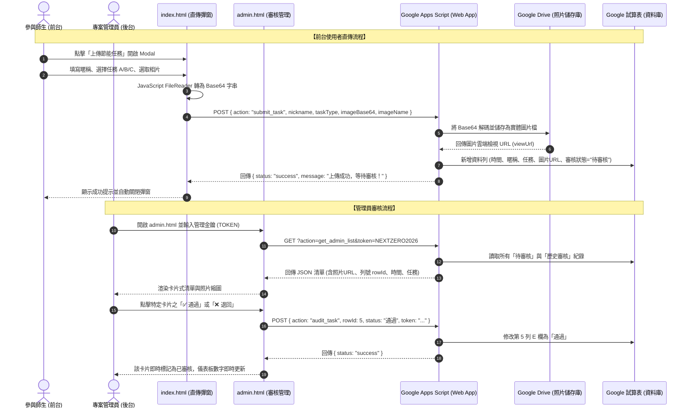

# NEXT ZERO 前台直傳與專屬管理審核後台技術實作規格書

---

## 壹、 系統升級目標與架構定義

本規格書旨在補足專案營運所需的兩大核心模組：
1. **前台內嵌式照片直傳系統（In-Page Direct Upload Modal）**：使用者點擊按鈕即可於當前頁面選取照片、填寫資訊並直接非同步上傳至 Google Drive 與 Google Sheets，無須跳離網站。
2. **專屬視覺化管理審核後台（Admin Review Portal, `admin.html`）**：提供安全密碼認證、卡片式待審核清單、即時照片大圖預覽與一鍵「通過 / 退回」審核操作。

---

## 貳、 系統交互循序圖 (Sequence Diagram)



---

## 參、 資料結構與 API 介面規格 (RESTful Schema)

### 一、 `POST` 端點：任務上傳 (`action: submit_task`)
- **請求格式 (Request Payload)**：
  ```json
  {
    "action": "submit_task",
    "nickname": "電機三甲 黃同學",
    "taskType": "任務A. 隨手關閉無人冷氣/電燈",
    "imageName": "task_photo.jpg",
    "imageBase64": "data:image/jpeg;base64,/9j/4AAQSkZJRgABAQ..."
  }
  ```
- **回應格式 (Response Payload)**：
  ```json
  {
    "status": "success",
    "message": "任務已成功提交，待管理員審核通過後即會點亮拼圖！",
    "fileUrl": "https://drive.google.com/file/d/..."
  }
  ```

---

### 二、 `GET` 端點：管理後台列表 (`action: get_admin_list`)
- **請求參數 (Query Params)**：
  `?action=get_admin_list&token=NEXTZERO2026`
- **回應格式 (Response Payload)**：
  ```json
  {
    "status": "success",
    "submissions": [
      {
        "rowId": 2,
        "timestamp": "2026-08-18T14:30:00.000Z",
        "nickname": "電機三甲 黃同學",
        "taskType": "任務A. 隨手關閉無人冷氣/電燈",
        "photoUrl": "https://drive.google.com/uc?id=...",
        "status": "待審核"
      }
    ]
  }
  ```

---

### 三、 `POST` 端點：執行審核 (`action: audit_task`)
- **請求格式 (Request Payload)**：
  ```json
  {
    "action": "audit_task",
    "token": "NEXTZERO2026",
    "rowId": 2,
    "status": "通過" 
  }
  ```
- **回應格式 (Response Payload)**：
  ```json
  {
    "status": "success",
    "message": "第 2 筆紀錄已更新為 通過"
  }
  ```
