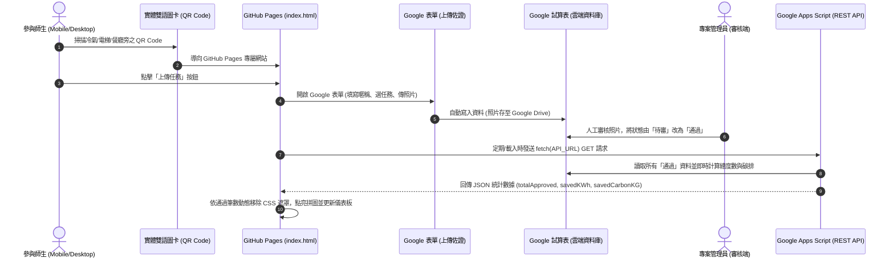

# NEXT ZERO 校園永續拼圖系統：GitHub Pages 完整技術實作與專案規格書

---

## 壹、 專案概述與核心架構

### 一、 專案緣起與目標
本專案為落實日本永續參訪（千葉大學 EGC 學生委員會、工學院大學生質能與魚電共生、三重大學行為激勵機制）之實踐成果，建立一套**免主機成本（零預算）**、**高互動性**且**具備量化實體成果**的校園減碳參與系統。

系統結合「**實體防水雙語圖卡**」與「**GitHub Pages 遊戲化互動拼圖網頁**」，讓全校師生透過日常減碳任務（隨手節能、自備餐具、校園巡檢），合力解鎖校園永續社區拼圖，並即時換算全校累積之節電度數（kWh）與減碳量（$\text{kg CO}_2\text{e}$）。

---

### 二、 系統全貌與資料流架構 (Serverless Jamstack)

系統以 **GitHub Pages** 為單一前端核心，後端結合 **Google 表單** 與 **Google 試算表** 作為無頭資料庫（Headless Database），並透過 **Google Apps Script (GAS)** 封裝為 RESTful JSON API。



---

## 貳、 GitHub Pages 前端專案規格與程式碼實作

### 一、 專案檔案結構
在本地端建立一個專案資料夾（如 `next-zero-puzzle/`），結構如下：

```text
next-zero-puzzle/
├── index.html          # 主頁面結構與語意標籤
├── style.css           # 現代化響應式 UI、CSS Grid 拼圖與過渡動畫
├── app.js              # 非同步 API 資料拉取、拼圖遮罩計算與 DOM 動態更新
└── puzzle.jpg          # 拼圖底圖（4:3 或 16:9 之校園永續插畫，解析度 1200x900 以上）
```

---

### 二、 前端核心程式碼

#### 1. `index.html`（結構與語意）
```html
<!DOCTYPE html>
<html lang="zh-TW">
<head>
  <meta charset="UTF-8">
  <meta name="viewport" content="width=device-width, initial-scale=1.0">
  <title>NEXT ZERO 校園永續拼圖解鎖計畫</title>
  <link rel="stylesheet" href="style.css">
  <!-- Google 字體提升排版質感 -->
  <link rel="preconnect" href="https://fonts.googleapis.com">
  <link rel="preconnect" href="https://fonts.gstatic.com" crossorigin>
  <link href="https://fonts.googleapis.com/css2?family=Noto+Sans+TC:wght@400;500;700&display=swap" rel="stylesheet">
</head>
<body>

  <header class="header">
    <div class="header-badge">NEXT ZERO 行動提案</div>
    <h1>校園永續社區拼圖</h1>
    <p class="subtitle">每完成一項減碳任務，為全校點亮一片綠色未來</p>
  </header>

  <main class="container">
    <!-- 行動呼籲按鈕（請替換為您的 Google 表單網址） -->
    <section class="action-section">
      <a href="YOUR_GOOGLE_FORM_URL" target="_blank" rel="noopener noreferrer" class="btn-primary" id="btn-upload">
        <span class="icon">📸</span> 點我上傳節能任務佐證
      </a>
      <p class="hint">免註冊帳號，僅需拍照上傳即可參與解鎖！</p>
    </section>

    <!-- 核心拼圖展示區塊 -->
    <section class="puzzle-wrapper">
      <div class="puzzle-header">
        <h2>全校解鎖進度</h2>
        <span class="badge-progress" id="progress-text">載入中...</span>
      </div>
      
      <div id="puzzle-container">
        <div id="grid"></div>
      </div>
    </section>

    <!-- 實體減碳數據儀表板 -->
    <section class="stats-grid">
      <div class="stat-card">
        <span class="stat-icon">🧩</span>
        <div class="stat-info">
          <h3 id="approved-count">0</h3>
          <p>已解鎖拼圖板塊</p>
        </div>
      </div>

      <div class="stat-card">
        <span class="stat-icon">⚡</span>
        <div class="stat-info">
          <h3 id="saved-kwh">0</h3>
          <p>累積預估節電 (度)</p>
        </div>
      </div>

      <div class="stat-card">
        <span class="stat-icon">🌱</span>
        <div class="stat-info">
          <h3 id="saved-carbon">0</h3>
          <p>累積預估減碳 (kg CO₂e)</p>
        </div>
      </div>
    </section>

    <!-- 任務說明指南 -->
    <section class="tasks-guide">
      <h2>📋 三大減碳解鎖任務</h2>
      <div class="task-list">
        <div class="task-item">
          <span class="task-tag tag-a">任務 A</span>
          <div class="task-desc">
            <strong>隨手節能：</strong>離開無人教室隨手關閉冷氣/電燈，或將空調設定為 26–28°C。
          </div>
        </div>
        <div class="task-item">
          <span class="task-tag tag-b">任務 B</span>
          <div class="task-desc">
            <strong>低碳生活：</strong>在校用餐自備環保餐具/環保杯，或以走樓梯替代 3 層以內電梯。
          </div>
        </div>
        <div class="task-item">
          <span class="task-tag tag-c">任務 C</span>
          <div class="task-desc">
            <strong>校園巡檢：</strong>發現並拍照回報校園公用設備異常耗能或漏水情事。
          </div>
        </div>
      </div>
    </section>
  </main>

  <footer class="footer">
    <p>NEXT ZERO Campus Sustainability Initiative © 2026</p>
  </footer>

  <script src="app.js"></script>
</body>
</html>
```

---

#### 2. `style.css`（現代化樣式、CSS Grid 與解鎖動畫）
```css
:root {
  --primary-color: #2e7d32;
  --primary-hover: #1b5e20;
  --bg-color: #f6f8f7;
  --card-bg: #ffffff;
  --text-main: #212529;
  --text-muted: #6c757d;
  --mask-color: rgba(22, 32, 26, 0.94);
  --border-radius: 14px;
}

* {
  box-sizing: border-box;
  margin: 0;
  padding: 0;
}

body {
  font-family: 'Noto Sans TC', -apple-system, BlinkMacSystemFont, "Segoe UI", Roboto, sans-serif;
  background-color: var(--bg-color);
  color: var(--text-main);
  line-height: 1.6;
  padding: 24px 16px;
}

.header {
  text-align: center;
  max-width: 640px;
  margin: 0 auto 24px;
}

.header-badge {
  display: inline-block;
  background-color: #e8f5e9;
  color: var(--primary-color);
  font-size: 13px;
  font-weight: 700;
  padding: 4px 12px;
  border-radius: 20px;
  margin-bottom: 8px;
}

.header h1 {
  font-size: 26px;
  color: #1a3024;
  margin-bottom: 6px;
}

.subtitle {
  color: var(--text-muted);
  font-size: 14px;
}

.container {
  max-width: 640px;
  margin: 0 auto;
  display: flex;
  flex-direction: column;
  gap: 20px;
}

.action-section {
  text-align: center;
  background: var(--card-bg);
  padding: 20px;
  border-radius: var(--border-radius);
  box-shadow: 0 4px 16px rgba(0, 0, 0, 0.05);
}

.btn-primary {
  display: inline-flex;
  align-items: center;
  justify-content: center;
  gap: 8px;
  background-color: var(--primary-color);
  color: #ffffff;
  text-decoration: none;
  font-size: 16px;
  font-weight: 700;
  padding: 14px 28px;
  border-radius: 30px;
  transition: all 0.25s ease;
  box-shadow: 0 4px 12px rgba(46, 125, 50, 0.25);
  width: 100%;
  max-width: 320px;
}

.btn-primary:hover {
  background-color: var(--primary-hover);
  transform: translateY(-2px);
  box-shadow: 0 6px 16px rgba(46, 125, 50, 0.35);
}

.hint {
  font-size: 12px;
  color: var(--text-muted);
  margin-top: 10px;
}

/* 拼圖外框與網格系統 (4x4 = 16 塊) */
.puzzle-wrapper {
  background: var(--card-bg);
  padding: 20px;
  border-radius: var(--border-radius);
  box-shadow: 0 4px 16px rgba(0, 0, 0, 0.05);
}

.puzzle-header {
  display: flex;
  justify-content: space-between;
  align-items: center;
  margin-bottom: 14px;
}

.puzzle-header h2 {
  font-size: 18px;
  color: #1a3024;
}

.badge-progress {
  background-color: #e8f5e9;
  color: var(--primary-color);
  font-size: 12px;
  font-weight: 700;
  padding: 4px 10px;
  border-radius: 12px;
}

#puzzle-container {
  position: relative;
  width: 100%;
  padding-top: 75%; /* 4:3 比例 */
  background: url('puzzle.jpg') no-repeat center center;
  background-size: cover;
  border-radius: 10px;
  overflow: hidden;
  box-shadow: inset 0 0 0 1px rgba(0, 0, 0, 0.1);
}

#grid {
  position: absolute;
  top: 0;
  left: 0;
  width: 100%;
  height: 100%;
  display: grid;
  grid-template-columns: repeat(4, 1fr);
  grid-template-rows: repeat(4, 1fr);
}

.tile {
  background-color: var(--mask-color);
  border: 0.5px solid rgba(255, 255, 255, 0.18);
  transition: background-color 0.8s cubic-bezier(0.4, 0, 0.2, 1), transform 0.4s ease;
  position: relative;
}

.tile.unlocked {
  background-color: transparent !important;
}

/* 數據儀表板 */
.stats-grid {
  display: grid;
  grid-template-columns: repeat(3, 1fr);
  gap: 12px;
}

.stat-card {
  background: var(--card-bg);
  padding: 16px 12px;
  border-radius: var(--border-radius);
  text-align: center;
  box-shadow: 0 4px 16px rgba(0, 0, 0, 0.05);
  display: flex;
  flex-direction: column;
  align-items: center;
  gap: 6px;
}

.stat-icon {
  font-size: 24px;
}

.stat-info h3 {
  font-size: 20px;
  color: var(--primary-color);
  font-weight: 700;
}

.stat-info p {
  font-size: 11px;
  color: var(--text-muted);
  font-weight: 500;
}

/* 任務指南清單 */
.tasks-guide {
  background: var(--card-bg);
  padding: 20px;
  border-radius: var(--border-radius);
  box-shadow: 0 4px 16px rgba(0, 0, 0, 0.05);
}

.tasks-guide h2 {
  font-size: 16px;
  margin-bottom: 14px;
}

.task-list {
  display: flex;
  flex-direction: column;
  gap: 12px;
}

.task-item {
  display: flex;
  align-items: flex-start;
  gap: 10px;
  font-size: 13px;
}

.task-tag {
  font-size: 11px;
  font-weight: 700;
  padding: 2px 8px;
  border-radius: 6px;
  white-space: nowrap;
}

.tag-a { background: #e3f2fd; color: #1976d2; }
.tag-b { background: #e8f5e9; color: #388e3c; }
.tag-c { background: #fff3e0; color: #f57c00; }

.footer {
  text-align: center;
  font-size: 12px;
  color: var(--text-muted);
  margin-top: 24px;
}

@media (max-width: 480px) {
  .stats-grid {
    grid-template-columns: 1fr;
  }
  .stat-card {
    flex-direction: row;
    justify-content: flex-start;
    padding: 12px 18px;
    gap: 16px;
  }
}
```

---

#### 3. `app.js`（非同步 API 與動態解鎖邏輯）
```javascript
// 請替換為您部署之 Google Apps Script Web App URL
const API_URL = "YOUR_GAS_WEB_APP_URL";
const TOTAL_TILES = 16; // 4x4 拼圖共 16 塊

document.addEventListener('DOMContentLoaded', () => {
  initGrid();
  fetchProgress();
});

// 初始化拼圖網格 DOM
function initGrid() {
  const grid = document.getElementById('grid');
  grid.innerHTML = '';
  for (let i = 0; i < TOTAL_TILES; i++) {
    const tile = document.createElement('div');
    tile.className = 'tile';
    tile.id = `tile-${i}`;
    grid.appendChild(tile);
  }
}

// 向 GAS 後端取得最新審核數據
async function fetchProgress() {
  const progressText = document.getElementById('progress-text');
  try {
    const res = await fetch(API_URL);
    if (!res.ok) throw new Error(`HTTP error! status: ${res.status}`);
    const data = await res.json();

    // 更新 DOM 統計數字
    animateValue('approved-count', 0, data.totalApproved, 800);
    animateValue('saved-kwh', 0, parseFloat(data.savedKWh), 800);
    animateValue('saved-carbon', 0, parseFloat(data.savedCarbonKG), 800);

    // 計算解鎖進度與解鎖方塊
    const unlockCount = Math.min(data.totalApproved, TOTAL_TILES);
    progressText.innerText = `已解鎖 ${unlockCount} / ${TOTAL_TILES} 塊 (${Math.round((unlockCount / TOTAL_TILES) * 100)}%)`;

    for (let i = 0; i < unlockCount; i++) {
      const tile = document.getElementById(`tile-${i}`);
      if (tile) {
        // 延遲依序解鎖，營造流暢動畫效果
        setTimeout(() => {
          tile.classList.add('unlocked');
        }, i * 70);
      }
    }
  } catch (err) {
    console.error('無法取得 API 數據:', err);
    progressText.innerText = '展示模式 (暫時離線)';
    // 錯誤降級處理：預設解鎖前 3 塊作示範
    for (let i = 0; i < 3; i++) {
      const tile = document.getElementById(`tile-${i}`);
      if (tile) tile.classList.add('unlocked');
    }
  }
}

// 數字漸進增加動畫
function animateValue(id, start, end, duration) {
  const obj = document.getElementById(id);
  if (!obj) return;
  const isFloat = end % 1 !== 0;
  let startTimestamp = null;
  const step = (timestamp) => {
    if (!startTimestamp) startTimestamp = timestamp;
    const progress = Math.min((timestamp - startTimestamp) / duration, 1);
    const val = progress * (end - start) + start;
    obj.innerText = isFloat ? val.toFixed(1) : Math.floor(val);
    if (progress < 1) {
      window.requestAnimationFrame(step);
    } else {
      obj.innerText = isFloat ? end.toFixed(1) : end;
    }
  };
  window.requestAnimationFrame(step);
}
```

---

## 參、 Google 後端資料庫與 GAS API 建立指南

### 一、 Google 表單題目設定
前往 [Google Forms](https://forms.google.com) 建立新表單：
1. **題目 1**：暱稱 / 系級（簡答題，必填）
2. **題目 2**：執行的節能任務（單選題，必填）
   - 選項 A：隨手關閉無人冷氣/電燈 (任務A)
   - 選項 B：自備環保餐具或走樓梯 (任務B)
   - 選項 C：回報校園設備異常耗能 (任務C)
3. **題目 3**：任務佐證照片（檔案上傳題，必填，限制圖片格式）

---

### 二、 Google 試算表設定
1. 點擊表單的「回覆」分頁 ➔ 點擊「**連結至試算表**」。
2. 在自動生成的試算表中，找到最後一欄（通常為 E 欄），將欄位標題命名為 `審核狀態`。
3. 選取 E 欄整欄 ➔ 點擊選單「資料」➔「**資料驗證**」➔ 新增規則：
   - 條件選擇「**下拉選單**」。
   - 選項設定：`待審核`（預設灰）、`通過`（綠色）、`退回`（紅色）。

---

### 三、 部署 Google Apps Script (GAS) 免費 API

1. 在試算表上方選單點選「**擴充功能**」➔「**Apps Script**」。
2. 清空既有程式碼，貼入以下 Production-Ready 程式碼：

```javascript
function doGet(e) {
  try {
    var sheet = SpreadsheetApp.getActiveSpreadsheet().getActiveSheet();
    var data = sheet.getDataRange().getValues();
    
    var totalApproved = 0;
    var taskCounts = { "taskA": 0, "taskB": 0, "taskC": 0 };
    
    // 從第 2 列開始讀取（略過第 1 列標題列）
    for (var i = 1; i < data.length; i++) {
      var row = data[i];
      var taskText = String(row[2] || "");    // 第 C 欄：任務選項
      var auditStatus = String(row[4] || ""); // 第 E 欄：審核狀態
      
      if (auditStatus.trim() === "通過") {
        totalApproved++;
        if (taskText.indexOf("冷氣") !== -1 || taskText.indexOf("任務A") !== -1) {
          taskCounts.taskA++;
        } else if (taskText.indexOf("餐具") !== -1 || taskText.indexOf("樓梯") !== -1 || taskText.indexOf("任務B") !== -1) {
          taskCounts.taskB++;
        } else {
          taskCounts.taskC++;
        }
      }
    }
    
    // 依據經濟部能源署與減碳係數計算
    var savedKWh = (taskCounts.taskA * 1.0 + taskCounts.taskB * 0.2 + taskCounts.taskC * 0.5).toFixed(1);
    var savedCarbonKG = (taskCounts.taskA * 0.495 + taskCounts.taskB * 0.15 + taskCounts.taskC * 0.25).toFixed(2);
    
    var payload = {
      status: "success",
      totalApproved: totalApproved,
      taskCounts: taskCounts,
      savedKWh: savedKWh,
      savedCarbonKG: savedCarbonKG,
      timestamp: new Date().toISOString()
    };
    
    return ContentService.createTextOutput(JSON.stringify(payload))
      .setMimeType(ContentService.MimeType.JSON);
      
  } catch (error) {
    var errorPayload = {
      status: "error",
      message: error.toString()
    };
    return ContentService.createTextOutput(JSON.stringify(errorPayload))
      .setMimeType(ContentService.MimeType.JSON);
  }
}
```

3. **發布為 Web App（重要步驟）**：
   - 點擊右上角「**部署**」➔「**新增部署作業**」。
   - 點選左側齒輪 ➔ 選擇「**網頁應用程式**」。
   - 填寫說明：`NEXT ZERO API v1.0`。
   - **執行身分**：選擇「**我**（您的 Google 帳號）」。
   - **誰可以存取**：務必選擇「**所有人 (Anyone)**」（否則前端網頁會因跨網域權限受阻）。
   - 按下「部署」並授權，複製取得的 **網頁應用程式網址（URL）**，將其貼入 `app.js` 的 `API_URL` 變數中。

---

## 肆、 GitHub Pages 部署與上線步驟

1. **建立 GitHub Repository**：
   - 登入 GitHub ➔ 點擊右上角「**New repository**」。
   - Repository 名稱輸入 `next-zero-campus`。
   - 選擇 **Public**（公開），點擊 **Create repository**。
2. **上傳專案檔案**：
   - 將已準備好的 `index.html`、`style.css`、`app.js` 與拼圖底圖 `puzzle.jpg` 上傳至該 Repository 的根目錄。
3. **啟用 GitHub Pages 託管服務**：
   - 點進該 Repository 的「**Settings**」分頁。
   - 點選左側欄位的「**Pages**」。
   - 在 **Build and deployment** 區塊：
     - Source 選擇 `Deploy from a branch`。
     - Branch 選擇 `main`（或 `master`），目錄選擇 `/ (root)`。
     - 點擊「**Save**」。
4. **取得線上網址**：
   - 等待約 1 分鐘後重新整理頁面，上方將出現正式 HTTPS 網址：
     $$\text{https://<您的GitHub帳號>.github.io/next-zero-campus/}$$

---

## 伍、 實體雙語圖卡與 QR Code 宣傳佈署

### 一、 QR Code 產出
1. 將上述 GitHub Pages 正式網址複製至 QR Code 產生工具（例如 Canva 或 QRCode Monkey）。
2. 下載高解析度 PNG 檔案。

### 二、 防水雙語圖卡設計規範

| 張貼場域 | 圖卡主題 | 雙語標題 (中 / 英) | 數據佐證文字 |
| :--- | :--- | :--- | :--- |
| **冷氣控制面板旁** | 任務 A：空調節能 | 隨手調高 1°C，為校園降溫<br>*Set AC to 26–28°C for a Greener Campus* | 每調高 1°C，每間教室每日省下約 **2.5 度電**。 |
| **學生餐廳回收區** | 任務 B：低碳餐飲 | 自備環保餐具，減塑減碳愛地球<br>*Bring Your Own Utensils, Cut Carbon Footprint* | 每減少一次免洗餐具，減少約 **0.15 kg** 碳排放。 |
| **公用走廊與電梯口** | 任務 B & C：走樓梯與巡檢 | 少搭三層電梯，巡檢節能同行<br>*Take the Stairs & Inspect Campus Energy Waste* | 走樓梯健康又省電，發現異常耗能請拍照通報！ |

---

## 陸、 效益分析與成果發表產出對接

本系統完成部署後，將直接產出兩大成果發表海報之關鍵實體內容：

1. **第一張海報（行動提案與實體成果）**：
   - **實體展示**：輸出 3 款防水雙語圖卡實體樣張。
   - **數據展示**：直接截取 GitHub Pages 上的即時儀表板數據（總參與人次、節電度數、減碳量圖表），證明提案非紙上談兵，而是具備全校參與之實體成效。
2. **第二張海報（個人參訪心得：黃翊軒）**：
   - **核心主軸**：從紙上理論走向務實改造（電機系專業與日本參訪之結合）。
   - **內容架構**：
     - **反思**：工學院大學生質能技術對「綠色魚塭」的啟發、Aizen 株式會社數據化設備改造。
     - **展望**：畢業後朝研究所深造，專注於「能源控管」與「電機工程」領域。
     - **結語**：*「減碳不只是公式上的數字，而是把每一份能源做到極致的工程實踐。」*
