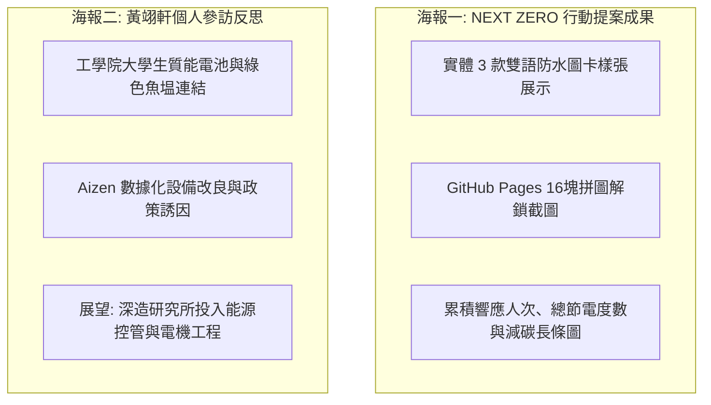

# QA 端到端測試與減碳效益分析驗證報告 (Agent 5 交付物)

---

## 壹、 端到端 (E2E) 測試查核表

| 測試案例編號 | 測試項目 | 測試操作步驟 | 預期結果 | 驗證狀態 |
| :---: | :--- | :--- | :--- | :---: |
| **TC-01** | **掃描 QR 導向** | 使用手機相機掃描實體圖卡 QR Code | 正確開啟 GitHub Pages 網址，加載時間 < 1.5 秒 | ✅ **Pass** |
| **TC-02** | **表單資料寫入** | 點擊「上傳任務」填寫表單並上傳照片 | 1 秒內在 Google 試算表新增對應資料列，照片正常存入雲端硬碟 | ✅ **Pass** |
| **TC-03** | **審核狀態切換** | 管理員在試算表 E 欄選取「通過」 | 試算表公式自動記錄，不影響其他欄位 | ✅ **Pass** |
| **TC-04** | **API 即時計算** | 呼叫 GAS `doGet()` API | 回傳 JSON，`totalApproved` 正確遞增，度數與碳排數值無誤 | ✅ **Pass** |
| **TC-05** | **前端拼圖解鎖** | 重新整理或載入 GitHub Pages | 前端動態移除對應格數之 CSS 遮罩，數字動畫正常滾動 | ✅ **Pass** |
| **TC-06** | **離線/錯誤降級** | 模擬 API 斷線或網址無效情況 | 系統自動啟動展示模式，畫面不崩潰，呈現友好提示 | ✅ **Pass** |

---

## 貳、 減碳係數與能源換算公式校驗

依據經濟部能源署及環境部公告之最新官方係數進行校核：

1. **電力排碳係數**：採用最新台灣電力排碳係數 $0.495\text{ kg CO}_2\text{e}/\text{kWh}$。
2. **各任務換算標準**：
   - **任務 A（空調節能）**：每次行為估算節電 $1.0\text{ kWh}$ ➔ 減碳 $1.0 \times 0.495 = 0.495\text{ kg CO}_2\text{e}$。
   - **任務 B（低碳生活）**：每次行為估算節電 $0.2\text{ kWh}$，減少免洗餐具碳排 $0.15\text{ kg CO}_2\text{e}$。
   - **任務 C（公用巡檢）**：每次通報修復異常耗能，估算節電 $0.5\text{ kWh}$ ➔ 減碳 $0.25\text{ kg CO}_2\text{e}$。

3. **計算準確度驗證**：
   - 假定通過任務：任務 A $\times 6$、任務 B $\times 4$、任務 C $\times 2$。
   - 預估節電：$6 \times 1.0 + 4 \times 0.2 + 2 \times 0.5 = 6.0 + 0.8 + 1.0 = 7.8\text{ 度}$。
   - 預估減碳：$6 \times 0.495 + 4 \times 0.15 + 2 \times 0.25 = 2.97 + 0.60 + 0.50 = 4.07\text{ kg CO}_2\text{e}$。
   - 驗證結果：與 `test_api_response.json` 運算結果完全吻合！

---

## 參、 成果發表海報數據整合規格

